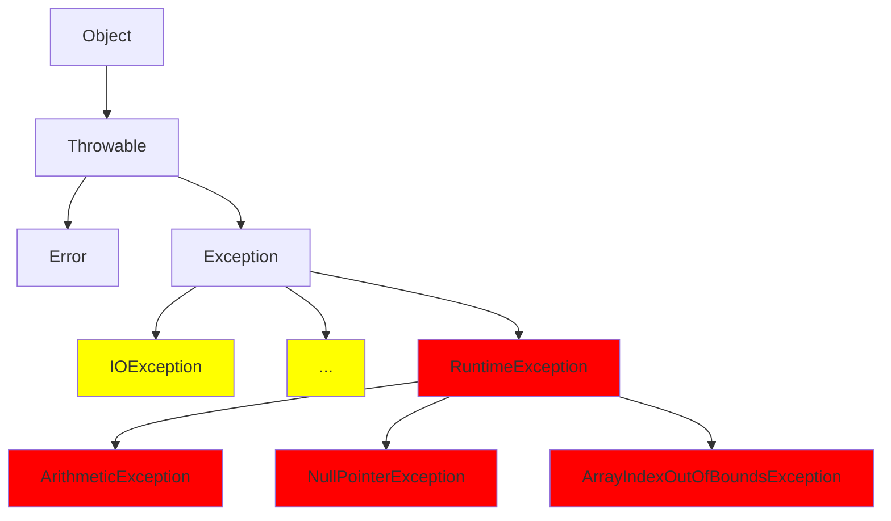

## 예외 (Exception)

#### Exception 이란?

예외는 프로그램에서 발생하는 일종의 오류의 개념. compile exception , runtime exception 두 가지로 구분할 수 있다.

- compile exception 

  - 코드 구문에서 문법이 잘못된 경우 발생하는 오류

  - 예외처리를 필요로하는 메소드를 예외 처리 구문 없이 사용하는 경우 발생

  - 컴파일 시에 발생

    

- runtime exception

  - 프로그램이 실행된 후에 발견되는 오류

  - 코드에 논리적으로 문제가 있는 경우에 주로 발생 

    

#### Exception 클래스의 종류

Exception 클래스 밑에는  IOException , NullPointerException과 같은 각기 다른 예외를 뜻하는 클래스들이 있다. 예외 처리 방식에 따라 구분하면 checked Exception , unchecked Exception으로 구분할 수 있다. 위의 다이어 그램에서 노란색은 checked exception , 빨간색은 unchekced exception이다.

- Checked Exception
  - Exception 클래스의 자식 클래스들 중에서 RuntimeException과 RuntimeException의 자식클래스를 제외한 나머지 클래스
  - 코드에서 반드시 예외처리를 해줘야함(throw 또는 try-catch)
  - 컴파일 단계에서 예외 발생
  - IOException이 보통 흔하게 발생하는 Exception
- Unchecked Exception
  - RuntimeException과 그 자식클래스
  - 반드시 예외 처리할 필요는 없음
  - 실행 단계에서 예외 발생
  - NullPointerException , ArrayIndexOutOfBoundsException 과 같은 예외가 자주들 보게 되는 Exception

<script src="">

> Reference 
>
> - http://tcpschool.com/java/java_exception_class